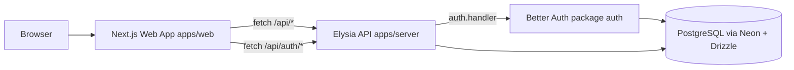
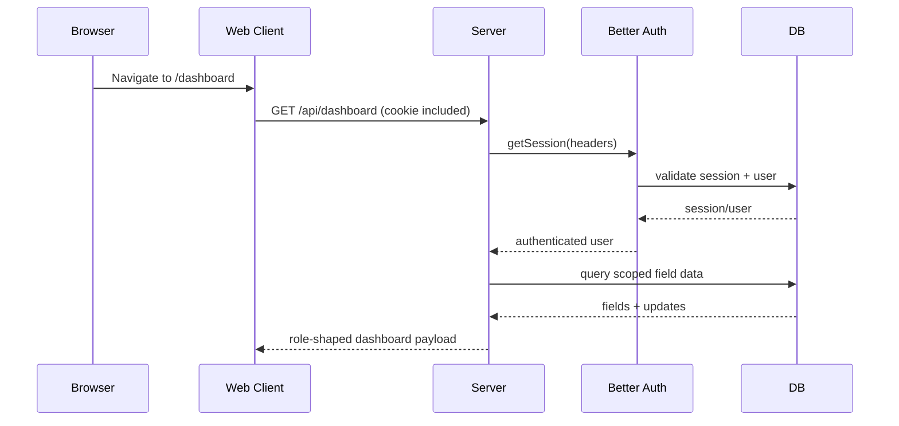

# Implementation Overview

## Project Structure

```text
shamba-records/
├── apps/
│   ├── web/              # Next.js App Router frontend (port 3001 in dev)
│   └── server/           # Elysia API server (port 3000)
├── packages/
│   ├── auth/             # Better Auth setup (Drizzle adapter + admin plugin)
│   ├── db/               # Drizzle schema + Neon connection + DB scripts
│   ├── env/              # Runtime env validation (server + web)
│   ├── ui/               # Shared UI primitives used by web app
│   └── config/           # Shared TypeScript/config package shell
├── turbo.json            # Monorepo task graph
├── pnpm-workspace.yaml   # Workspace + dependency catalog
└── tsconfig.json         # Root TS extends shared base config
```

## What Has Been Implemented (Technical Summary)

- Monorepo orchestration with Turborepo + pnpm workspaces.
- Next.js frontend (`apps/web`) with route-based dashboard pages:
  - `/dashboard`
  - `/dashboard/fields`
  - `/dashboard/activity`
  - `/dashboard/users`
- Elysia backend (`apps/server`) exposing domain APIs under `/api/*`.
- Better Auth integration mounted at `/api/auth/*` from server and backed by Drizzle + PostgreSQL schema.
- Role model in DB and app logic:
  - `admin`: full operational control
  - `agent`: scoped to assigned fields and updates
- Admin users CRUD wired through Better Auth admin endpoints from frontend API client.
- Dashboard UX optimized to keep shell/static layout mounted during internal navigation via a shared dashboard provider.

## Runtime Architecture



## API and Domain Design

The server composes:

- CORS plugin with credentials enabled.
- Better Auth route passthrough at `/api/auth/*`.
- `fieldsModule` for domain APIs.

Fields module endpoints include:

- `GET /api/me`
- `GET /api/dashboard`
- `GET /api/agents` (admin only)
- `GET /api/fields`
- `POST /api/fields` (admin only)
- `PATCH /api/fields/:fieldId` (admin only)
- `POST /api/fields/:fieldId/assign` (admin only)
- `GET /api/fields/:fieldId/updates`
- `POST /api/fields/:fieldId/updates`

Request payloads are validated with Elysia `t.*` schemas in `modules/fields/model.ts`.

## OpenAPI and Swagger

- API documentation is generated via `@elysiajs/openapi` in the server app.
- Swagger UI is exposed at `/swagger` using the plugin provider `swagger-ui`.
- The raw OpenAPI JSON spec is exposed at `/swagger/json`.
- OpenAPI info is customized in plugin config:
  - Title: `Shamba Records API`
  - Version: `1.0.0`
  - Description: `API for authentication, dashboard data, and field operations.`
- Documentation tags currently include `Fields` for domain grouping.

## Auth + Authorization Model

- Authentication: Better Auth session cookies.
- Session lookup in backend service: `auth.api.getSession({ headers })`.
- User role persisted on `user.role` (`admin` or `agent`).
- Authorization enforced in service methods, not just UI.



## Data Model Essentials

Core tables in the implemented schema:

- `user`, `session`, `account`, `verification` (auth system)
- `field`
- `field_assignment`
- `field_update`

Field lifecycle implemented as:

- Stage: `planted | growing | ready | harvested`
- Status: `active | completed`
- Current status computation: `harvested -> completed`, otherwise `active`

## Frontend State and Routing Strategy

- Dashboard pages are real App Router routes (not anchor sections).
- `apps/web/src/app/dashboard/layout.tsx` performs session guard and wraps with `DashboardApp`.
- `DashboardApp` mounts `DashboardProvider` once and keeps sidebar/shell persistent.
- Route content pages consume `useDashboard()` context.
- Result: no full dashboard remount on sidebar route change, while data refresh remains explicit via refresh action.

```mermaid
flowchart TD
  L[dashboard layout.tsx]
  A[DashboardApp]
  P[DashboardProvider]
  S[DashboardShell persistent]
  R1[/dashboard]
  R2[/dashboard/fields]
  R3[/dashboard/activity]
  R4[/dashboard/users]

  L --> A --> P --> S
  S --> R1
  S --> R2
  S --> R3
  S --> R4
```

## Build, Type Safety, and Operational Notes

- TypeScript is enforced across packages/apps (`turbo check-types` and per-package checks).
- Frontend API client is typed and centralizes fetch behavior (`credentials: include`, `cache: no-store`).
- Environment variables are schema-validated via `@t3-oss/env-*` packages.
- DB workflows are implemented in `packages/db` scripts (`db:push`, `db:generate`, `db:migrate`, `db:studio`).
- I did not find an explicit automated test suite (`*.test.*`, `*.spec.*`, or `test` scripts in package manifests).

## Assessor-Focused Implementation Notes

- The codebase separates concerns cleanly: UI, API, auth, env, and DB are split by workspace package.
- Authorization is enforced server-side in domain services, reducing reliance on frontend-only guards.
- The dashboard architecture has been refactored to improve perceived performance and navigation continuity.
- Admin user management is integrated through Better Auth admin plugin endpoints instead of custom user CRUD tables/controllers.
